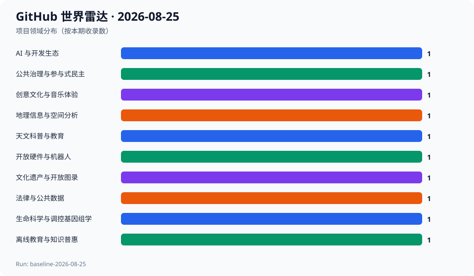
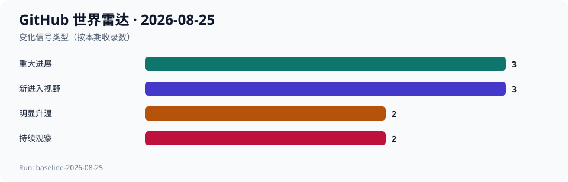

# GitHub 世界雷达 · 2026-08-25

> 生成时间：`2026-08-25T11:17:45+08:00` · 观察窗口：`2026-07-26` 至 `2026-08-25` · Run：`baseline-2026-08-25`

首期基线显示，GitHub 的近期活跃不只来自 AI：专业 GIS、消费级开放机器人、生命科学工作流、数字公共基础设施和文化档案正在同时演进。由于尚无历史快照，7 日和 30 日增量保持为空，本期只用创建时间、当前规模、近期提交和 Release 作为代理信号。

## 今日趋势

- 专业能力正在被封装成浏览器、移动端或消费级可体验产品。
- 公共数据正从静态文件转向可计算、可复用的开放基础设施。
- GitHub 正在承载开放出版、文化档案和行业记忆，而不只是代码。
- 显性热度仍高度集中于 AI，但极端增长需要连续快照复核。
- 许可证不明确是创意和文化类项目的主要采用风险。

## 跨领域发现

| 项目 | 领域 | 它是什么 | 为什么现在 | 信号 | 阶段 | 置信度 |
| --- | --- | --- | --- | --- | --- | --- |
| [deepseek-ai/deepseek-harness](../projects/deepseek-ai--deepseek-harness.md) | AI 与开发生态 | 项目方将其描述为一切皆插件的 AI Harness。 | 项目创建于 2026-08-13，截至本次观察已显示 192534 Star 和 21597 Fork，是本期无法忽略的强热度信号。 | AI Agent 生态正在把扩展能力进一步抽象为插件化运行层。 | 快速成长 | 中 |
| [opengeos/GeoLibre](../projects/opengeos--GeoLibre.md) | 地理信息与空间分析 | 一个面向浏览器、桌面、移动端和 Jupyter 的轻量云原生 GIS 平台。 | 项目创建约三个月，2026-08-22 发布 v2.7.0，2026-08-25 仍有提交。 | 专业空间分析工具正在转向跨端、轻量和交互式体验。 | 快速成长 | 高 |
| [makerspet/oomwoo](../projects/makerspet--oomwoo.md) | 开放硬件与机器人 | 一个结合 3D 打印、ESP32、LiDAR 和 ROS2 的开源扫地机器人项目。 | 项目创建约两个半月，当前已有 9246 Star，并在 2026-08-24 保持提交。 | 消费级机器人正在从封闭成品转向社区可复现的硬件与软件组合。 | 快速成长 | 高 |
| [XxHuberrr/Mineradio](../projects/XxHuberrr--Mineradio.md) | 创意文化与音乐体验 | 一款以电影镜头、粒子视觉和歌词舞台为核心的沉浸式音乐播放器。 | 年轻项目已超过一万 Star，并于 2026-07-31 发布 v2.1.0。 | 开源音乐产品正在从功能型播放器转向舞台化和电影化体验。 | 早期探索 | 中 |
| [oncologylab/fp-tools](../projects/oncologylab--fp-tools.md) | 生命科学与调控基因组学 | 面向 ATAC-seq footprinting、motif 分析和可复现交互报告的命令行工作流。 | 2026-08-19 发布 v0.1.18，并在 2026-08-22 继续提交。 | 专业生命科学分析正被收束为更易复现、更易交付的命令式工具链。 | 早期探索 | 高 |
| [hyqzz/Solar-Wanderer](../projects/hyqzz--Solar-Wanderer.md) | 天文科普与教育 | 一个结合 NASA JPL 星历、实时尺度和浏览器 3D 的太阳系探索器。 | 项目在 2026-08-23 仍有提交，且已发布包含行星大气视觉改进的 v2.2.0。 | 科研数据正在直接转化为普通人可探索的交互式教育体验。 | 早期探索 | 高 |
| [dososo/chinese-traditional-patterns](../projects/dososo--chinese-traditional-patterns.md) | 文化遗产与开放图录 | 一个将中国传统纹样整理为多语种数字图录的开放项目。 | 2026-06-16 新建，项目方已整理 100 个高清纹样并规划扩展至 800 个。 | GitHub 正在成为文化遗产数字化、开放出版和设计资源协作的基础设施。 | 概念实验 | 中 |
| [Vaquill-AI/open-us-law](../projects/Vaquill-AI--open-us-law.md) | 法律与公共数据 | 项目方称其提供美国主要法律文本的开放结构化语料及构建管线。 | 项目创建于 2026-07-18，并在 2026-08-21 继续更新。 | 公共法律文本正在从网页和文档转化为机器可读、可持续构建的数据基础设施。 | 早期探索 | 中 |
| [decidim/decidim](../projects/decidim--decidim.md) | 公共治理与参与式民主 | 一个持续维护的参与式民主和公共协作框架。 | 成熟项目在 2026-07-30 发布 v0.32.1，并于 2026-08-25 保持推送。 | 参与式治理软件正作为数字公共基础设施持续产品化，而不是一次性实验。 | 成熟项目重新升温 | 高 |
| [iiab/iiab](../projects/iiab--iiab.md) | 离线教育与知识普惠 | 通过 Raspberry Pi 建立离线知识库和社区教育资源的长期项目。 | 项目在 2026-08-24 仍有提交，显示其在最新正式 Release 之后继续维护。 | 知识普惠并不只依赖云端服务，离线基础设施仍连接教育、人权和社区网络。 | 稳定发展 | 高 |

