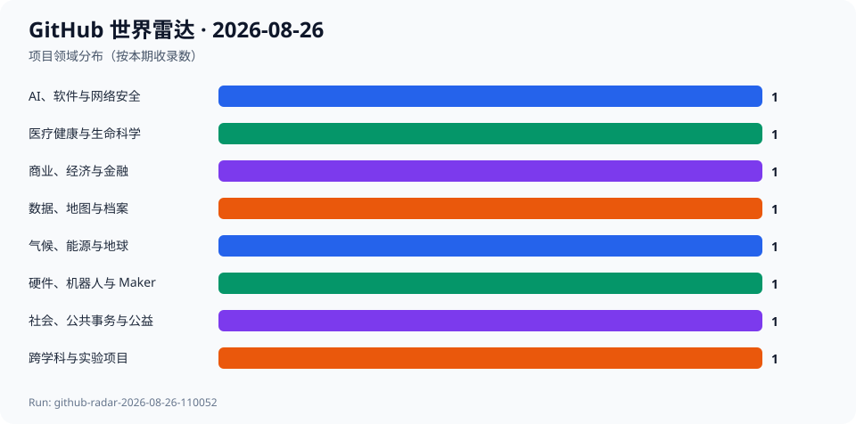
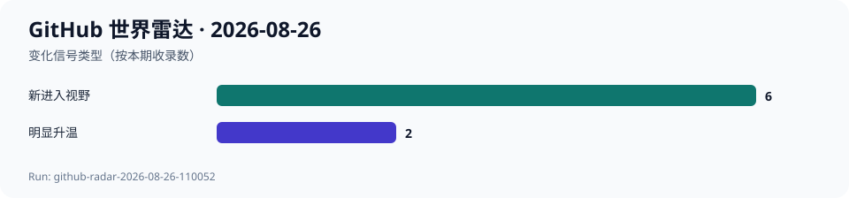

# GitHub 世界雷达 · 2026-08-26

> 生成时间：`2026-08-26T11:07:00+08:00` · 观察窗口：`2026-07-27` 至 `2026-08-26` · Run：`github-radar-2026-08-26-110052`

本期通过 GitHub Trending、Search 与 API 建立约 60 个跨领域候选，并核验仓库、默认分支活动、Release 与许可证。最终选择 8 个项目、覆盖 7 个领域：显性关注仍被 AI 插件生态吸引，但医疗隐私、海洋模拟、公共规划、纯文本记账和开放硬件都有可验证的新进展。当前只有相隔约一天的两次本地快照，因此 7 日和 30 日 Star 增量继续保留为 null；对连续项目仅把可复核的一日差值写入代理信号。

## 今日趋势

- 显性关注与开发事件正在分离：deepseek-harness 一日净增 3123 Star，但默认分支最新提交仍停留在 2026-08-21。
- 专业工具继续产品化：医疗文本去标识、海洋流体模拟和纯文本复式记账都在最近五天内发布新版本。
- 公共利益软件的现实价值不由 Star 决定：Planning Alerts 只有 115 Star，却仍在维护面向居民的地方规划数据映射。
- 开放硬件正在与表演和公民科学交叉：LED 合成器与树莓派鸟声监测把软件、实体装置和现实观察连接起来。
- 因尚无完整 7 日与 30 日历史快照，本期不把累计规模或一日变化冒充中期增长率。

## 跨领域发现

| 项目 | 领域 | 它是什么 | 为什么现在 | 信号 | 阶段 | 置信度 |
| --- | --- | --- | --- | --- | --- | --- |
| [deepseek-ai/deepseek-harness](../projects/deepseek-ai--deepseek-harness.md) | AI、软件与网络安全 | 项目方将其描述为“一切皆插件”的 AI Harness。 | 从 2026-08-25 到 2026-08-26 的相邻快照中，Star 从 192534 增至 195657、Fork 从 21597 增至 22148；但默认分支最新提交仍是 2026-08-21。 | 推断：插件化 Agent 运行层仍在快速吸引注意力，但传播热度与代码进展需要分开观察。 | 快速成长 | 中 |
| [opengeos/GeoLibre](../projects/opengeos--GeoLibre.md) | 数据、地图与档案 | 项目方将其描述为可运行于浏览器、桌面、移动端和 Jupyter 的轻量云原生 GIS 平台。 | 2026-08-22 发布 v2.7.0，2026-08-26 默认分支继续修正文档与应用的一致性；相邻一日快照中 Star 增加 45、Fork 增加 5。 | 推断：专业地理分析能力正在继续向跨端、轻量和交互式产品形态迁移。 | 快速成长 | 高 |
| [maziyarpanahi/openmed](../projects/maziyarpanahi--openmed.md) | 医疗健康与生命科学 | 项目方称其提供本地优先的临床实体识别和医疗隐私信息去标识能力。 | 2026-08-21 发布 v2.2.0，2026-08-25 默认分支仍有合并提交；本期首次纳入雷达。 | 推断：医疗文本处理正在把多语言模型、隐私去标识和本地运行组合成更完整的工具链。 | 稳定发展 | 中 |
| [CliMA/Oceananigans.jl](../projects/CliMA--Oceananigans.jl.md) | 气候、能源与地球 | 项目方称其为可在 CPU 和 GPU 上运行的 Julia 海洋流体动力学模拟软件。 | 2026-08-21 发布 v0.110.19，2026-08-25 又修复 Zarr 分块参数重复问题；本期首次纳入雷达。 | 推断：高性能科学模拟正在同时追求加速计算、可组合数据格式和更可复现的研究工作流。 | 稳定发展 | 高 |
| [rustledger/rustledger](../projects/rustledger--rustledger.md) | 商业、经济与金融 | 项目方将其描述为兼容 Beancount 的现代纯文本记账工具。 | 2026-08-21 发布 v0.22.0，2026-08-26 截止前仍在修复文档构建；本期首次纳入雷达。 | 推断：可审计、可版本控制的个人和小型组织财务工作流正在进入更现代的系统语言生态。 | 早期探索 | 中 |
| [openaustralia/planningalerts](../projects/openaustralia--planningalerts.md) | 社会、公共事务与公益 | 项目方称其帮助居民获知所在地区正在建设或拆除什么，并参与地方规划。 | 2026-08-26 截止前约 22 分钟合并了地方政府 authority mapping 修复；本期首次纳入雷达。 | 推断：公民科技的价值更多来自持续校准现实行政数据，而不是追逐大型产品发布或开发者热度。 | 稳定发展 | 高 |
| [engmung/Patternflow](../projects/engmung--Patternflow.md) | 硬件、机器人与 Maker | 项目方称其为可用手指演奏光效图案的开源 LED 合成器。 | 2026-08-25 发布 v3.6.3，随后默认分支继续更新；本期首次纳入雷达。 | 推断：开放硬件正在把灯光控制从工程配置转化为接近乐器的实时表演界面。 | 早期探索 | 中 |
| [zach7036/BirdNET-Pi-Enhanced-Version](../projects/zach7036--BirdNET-Pi-Enhanced-Version.md) | 跨学科与实验项目 | 项目方称其为运行在 Raspberry Pi 上的鸟类声音监测平台，整合实时识别、天气、eBird 和分析功能。 | 2026-08-22 发布 v2.5.2；虽然只有 27 Star，但它把低成本硬件、边缘识别和自然观察连接在一起，本期首次纳入雷达。 | 推断：公民科学工具正在把原本专业的生物声学监测下沉到家庭和社区级长期观察。 | 早期探索 | 中 |

