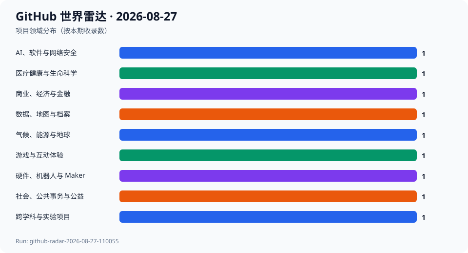
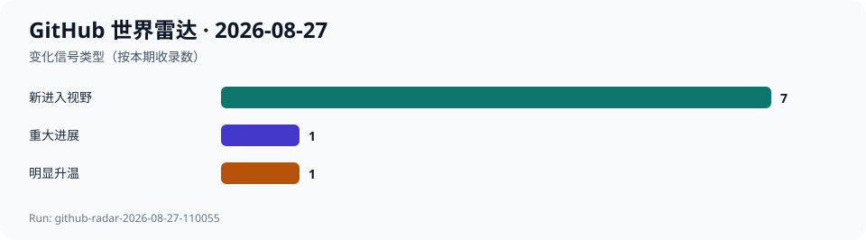

# GitHub 世界雷达 · 2026-08-27

> 生成时间：`2026-08-27T13:38:00+08:00` · 观察窗口：`2026-07-28` 至 `2026-08-27` · Run：`github-radar-2026-08-27-110055`

本期通过 GitHub Trending、Search、REST/GraphQL API、Release、Commit、Issue 与 PR 建立约 90 个跨领域候选，最终选择 9 个项目、覆盖 9 个领域。过去 24 小时最值得关注的并非单一 AI 事件，而是政府福利申请、开放数据门户、支付编排、科学可视化、节奏游戏和机器人平台同时出现可核验更新。deepseek-harness 的关注度仍高速增加但代码继续停在 2026-08-21，进一步说明传播热度与开发事件必须分开判断。当前只有三次连续快照，仍不足以计算完整 7 日和 30 日增量，因此相关字段继续为 null。

## 今日趋势

- 公共数字基础设施进入集中发布窗口：CiviForm v3.35.0 与 CKAN 2.12.0 都在 2026-08-26 发布。
- deepseek-harness 在相邻快照间增加 2876 Star 和 455 Fork，但默认分支仍无新提交，传播热度继续领先于代码进展。
- 科研工具开始把新图形硬件接口与可验证数值修复并行推进：GenomeSpy 合入开发阶段 WebGPU 渲染器，Oceananigans 修复显式时间离散路径并补充回归测试。
- 非 AI 创作和实体系统出现明确发布信号：Etterna 发布十周年版本，BlueOS 继续更新机器人平台，patchies 持续拆分可编程视听渲染模块。
- 支付、福利、身份、机器人和医疗相关项目都具有现实风险；入选只表示近期公开信号值得观察，不构成采用或安全背书。

## 跨领域发现

| 项目 | 领域 | 它是什么 | 为什么现在 | 信号 | 阶段 | 置信度 |
| --- | --- | --- | --- | --- | --- | --- |
| [deepseek-ai/deepseek-harness](../projects/deepseek-ai--deepseek-harness.md) | AI、软件与网络安全 | 项目方将其描述为“一切皆插件”的 AI Harness。 | 从 2026-08-26 到 2026-08-27 的相邻快照中，Star 从 195657 增至 198533、Fork 从 22148 增至 22603；默认分支最新提交仍是 2026-08-21。 | 推断：插件化 Agent 运行层仍在吸引大量关注，但传播增长已连续两期与代码更新脱钩。 | 快速成长 | 中 |
| [civiform/civiform](../projects/civiform--civiform.md) | 社会、公共事务与公益 | 项目方称其通过复用申请人数据，简化多个政府福利项目的申请流程。 | 2026-08-26 发布 v3.35.0，发布后默认分支继续维护构建链；本期首次纳入雷达。 | 推断：政府数字服务正在把重复填表问题转化为可复用、可持续发布的公共软件基础设施。 | 稳定发展 | 高 |
| [ckan/ckan](../projects/ckan--ckan.md) | 数据、地图与档案 | 项目方称 CKAN 是用于建设开放数据中心和数据门户的数据管理系统。 | 2026-08-26 发布 CKAN 2.12.0，同时维护多个旧版本线；本期首次纳入雷达。 | 推断：开放数据的关键竞争点正在从一次性发布文件转向长期可升级的数据门户基础设施。 | 成熟项目重新升温 | 高 |
| [juspay/hyperswitch](../projects/juspay--hyperswitch.md) | 商业、经济与金融 | 项目方称其为可组合、可自托管的支付编排平台，连接支付、风控、金库和对账服务。 | 2026-08-24 发布 v1.126.0，2026-08-27 截止前默认分支仍有版本提交；本期首次纳入雷达。 | 推断：支付基础设施正在从单一通道接入转向可观测、可路由和可替换的编排层。 | 稳定发展 | 中 |
| [genome-spy/genome-spy](../projects/genome-spy--genome-spy.md) | 医疗健康与生命科学 | 项目方称其为基因组数据的可视化语法和 GPU 加速工具包。 | 2026-08-26 合入开发阶段 WebGPU 渲染器，2026-08-19 发布 v0.85.0；本期首次纳入雷达。 | 推断：专业基因组可视化正在为浏览器新一代 GPU 接口重构渲染管线，而不只是增加图表类型。 | 早期探索 | 高 |
| [CliMA/Oceananigans.jl](../projects/CliMA--Oceananigans.jl.md) | 气候、能源与地球 | 项目方称其为可在 CPU 和 GPU 上运行的 Julia 海洋流体动力学模拟软件。 | 继昨日入选后，2026-08-26 又修复显式时间离散路径中的三个潜在错误并补充回归测试；Star 和 Fork 保持不变。 | 推断：科研基础设施的真实进展常表现为边界条件、数值路径和回归测试的精细修复，而不是热度增长。 | 稳定发展 | 高 |
| [etternagame/etterna](../projects/etternagame--etterna.md) | 游戏与互动体验 | 项目方称其为专注键盘操作的高级跨平台节奏游戏。 | 2026-08-27 发布十周年版本 v0.75.0，默认分支同日有提交；本期首次纳入雷达。 | 推断：成熟社区游戏仍可通过长期协作和周年版本保持生命力，不依赖平台级商业发行。 | 成熟项目重新升温 | 高 |
| [bluerobotics/BlueOS](../projects/bluerobotics--BlueOS.md) | 硬件、机器人与 Maker | 项目方称其为面向 ROV、USV 等机器人系统运行、开发和扩展的开源平台。 | 2026-08-25 发布稳定版 1.4.5，2026-08-27 默认分支继续修复 Kraken 代理缓冲；本期首次纳入雷达。 | 推断：机器人生态正在把设备控制、扩展和运维能力收束为面向真实任务的平台层。 | 稳定发展 | 中 |
| [heypoom/patchies](../projects/heypoom--patchies.md) | 跨学科与实验项目 | 项目方称用户可以在 Web 上编写小程序并将其拼接，用于交互视觉、声音和计算实验。 | 2026-08-26 修复 worker 设置回调并继续拆分渲染模块；规模不大但近期开发活动明确，本期首次纳入雷达。 | 推断：创意编程工具正在把代码、节点图、声音和视觉统一为可即时组合的浏览器实验环境。 | 早期探索 | 中 |

