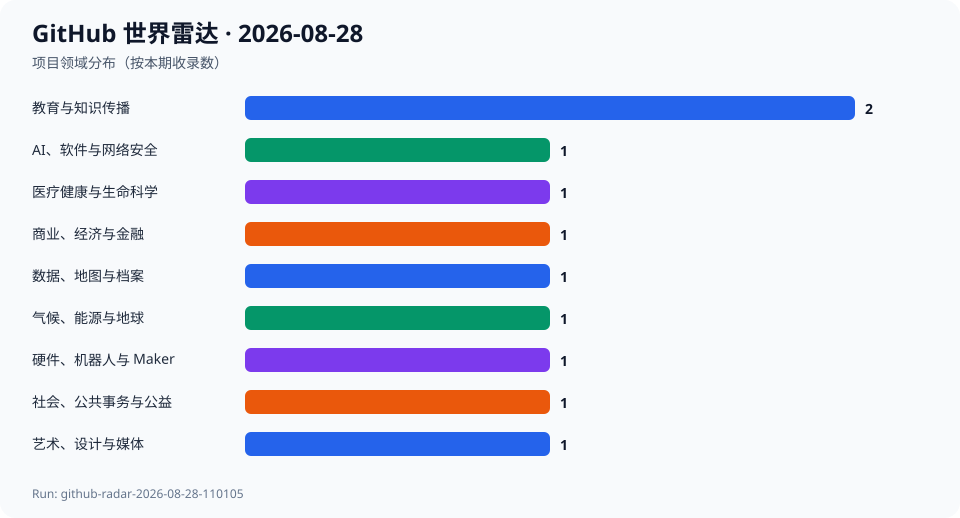
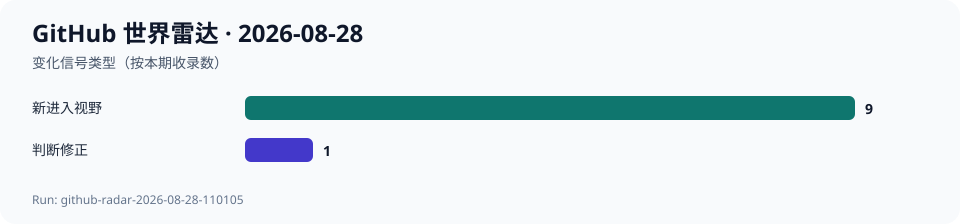

# GitHub 世界雷达 · 2026-08-28

> 生成时间：`2026-08-28T11:22:58+08:00` · 观察窗口：`2026-07-29` 至 `2026-08-28` · Run：`github-radar-2026-08-28-110105`

本期通过 GitHub Trending、Search、REST API、Release、Commit、Issue 与 PR 审阅超过 60 个跨领域候选，最终选择 10 个项目、覆盖 9 个领域。最显著的判断修正是 deepseek-harness 结束了连续数日‘传播升温但代码不动’的状态，出现新提交与首个预发布版本；与此同时，大气模型、电子病历、教学协作、个人财富管理、开放语音、无人机硬件和实时视听创作都有可核验更新。两个意外发现分别把昆虫科普和租户住房证据带进可交互、可验证的数字工具。当前只有四次连续快照，仍不足以计算完整 7 日和 30 日 Star 增量，相关字段继续为 null。

## 今日趋势

- deepseek-harness 在相邻快照间增加 2027 Star 和 339 Fork，并于 2026-08-27 合并新版本、发布首个预发布版本；此前‘热度与代码进展脱钩’的判断需要修正。
- 科学软件开始把配置正确性作为一等产物：ClimaAtmos 为海温覆盖条件增加显式警告和 CI 测试，而不是只增加模型能力。
- 公共与教育工具正在强化可审计协作：Classroom50 自动发布新版，habitable 则让多个家庭能联合提交证据而不合并各自保管链。
- 开放数据与个人财务工具都在处理现实边界：Common Voice 扩展语言覆盖，Ghostfolio 修正非 UTC 时区下的汇率和历史行情日期问题。
- 实体硬件和实时创作仍是普通热门榜容易忽略的活动带：OpenESC-20x20 更新可制造设计，Infinite 在年轻版本中修复参数面板冻结问题。
- 本期只使用相邻快照差值和公开活动作为代理信号，不把累计 Star 或不足 7 日的变化冒充中期增长率。

## 跨领域发现

| 项目 | 领域 | 它是什么 | 为什么现在 | 信号 | 阶段 | 置信度 |
| --- | --- | --- | --- | --- | --- | --- |
| [deepseek-ai/deepseek-harness](../projects/deepseek-ai--deepseek-harness.md) | AI、软件与网络安全 | 项目方将其描述为“一切皆插件”的 AI Harness。 | 从 2026-08-27 到 2026-08-28 的相邻快照中，Star 从 198533 增至 200560、Fork 从 22603 增至 22942；默认分支在 2026-08-27 合并 dsh 0.1.2-alpha.1，并首次出现正式 GitHub Release。 | 推断：传播热度仍然极高，但本期终于出现与热度同步的代码和版本事件，因此此前连续两期‘只有传播增长’的判断需要修正。 | 快速成长 | 高 |
| [CliMA/ClimaAtmos.jl](../projects/CliMA--ClimaAtmos.jl.md) | 气候、能源与地球 | 项目方称其为 CliMA 地球系统模型中的 GPU 全球大气模型，支持数据同化和机器学习校准。 | 2026-08-21 发布 v0.42.7；2026-08-27 最新提交为 SlabOceanSST 覆盖表面温度条件时增加明确警告并将测试接入 CI，属于影响科学配置正确性的实质修正。 | 推断：成熟科学计算项目正在把隐式配置覆盖变成可观察、可回归验证的行为，模型可信度越来越依赖工程护栏。 | 稳定发展 | 高 |
| [openemr/openemr](../projects/openemr--openemr.md) | 医疗健康与生命科学 | 项目方称其为开源电子病历与诊所管理系统，覆盖排班、账单、国际化、API 和 FHIR。 | OpenEMR 8.3.0 于 2026-08-18 发布；2026-08-28 的最新提交继续重构模板依赖，并把参数错误页面从隐式 HTTP 200 修正为 400。 | 推断：长期医疗软件仍在通过细小但关键的协议语义和依赖治理修复来降低集成歧义，而不只是追逐新功能。 | 成熟项目重新升温 | 高 |
| [foundation50/classroom50](../projects/foundation50--classroom50.md) | 教育与知识传播 | 项目方将其描述为 GitHub Classroom 的开源替代，用于创建、管理和自动批改编程作业。 | 2026-08-28 默认分支合并发布提交，并在数秒后发布 web-v1.35.0；约四个月的年轻项目已形成持续自动发布节奏。 | 推断：编程教育基础设施正在从单一托管服务转向可检查、可组合的 Web、CLI、模板与 Actions 工作流。 | 快速成长 | 高 |
| [xr843/insect-world](../projects/xr843--insect-world.md) | 教育与知识传播 | 项目方称其为浏览器实时生成的 3D 昆虫图鉴，包含 63 个物种、14 个目及部分完整生活史。 | 项目创建于 2026-08-06，当前已有 657 Star；2026-08-27 新增按身体部位横向浏览，年轻科普体验仍在快速打磨。 | 推断：无需下载模型文件的程序化 3D 正在把自然史图鉴变成可探索的交互体验，但内容可信度仍是独立问题。 | 早期探索 | 中 |
| [ChelseaKR/habitable](../projects/ChelseaKR--habitable.md) | 社会、公共事务与公益 | 项目方称其为租户组织离线、加密记录住房适居性证据的工具，包含时间戳、保管链和点对点同步。 | 2026-08-28 新增多个家庭各自签名证据包的联合提交索引，并明确不合并各自保管链；只有 3 Star，却触及真实公共利益场景。 | 推断：一些公民科技项目开始把密码学和证据保管边界用在普通人的住房争议中，而不是停留在数据展示。 | 早期探索 | 中 |
| [ghostfolio/ghostfolio](../projects/ghostfolio--ghostfolio.md) | 商业、经济与金融 | 项目方称其为强调隐私、数据所有权与自托管的开源财富管理软件。 | 2026-08-27 发布 3.62.0，新增共享投资组合访问的到期日和最后使用时间，并修复多个非 UTC 时区下的汇率、图表和历史行情日期问题。 | 推断：个人财富工具的竞争点正在从‘能聚合资产’转向共享边界、时区正确性和用户对敏感数据的控制。 | 稳定发展 | 高 |
| [common-voice/common-voice](../projects/common-voice--common-voice.md) | 数据、地图与档案 | 项目方称其通过公众捐赠语音建立开放语音数据集，帮助语音技术覆盖更多真实说话方式。 | 2026-08-27 默认分支继续更新法语本地化；本周还加入黎凡特阿拉伯语变体，显示社区语言覆盖仍在扩展。 | 推断：开放语音基础设施的长期价值更多来自语言和社区覆盖，而不是单次模型发布或累计 Star。 | 稳定发展 | 高 |
| [OpenDrone-hw/OpenESC-20x20](../projects/OpenDrone-hw--OpenESC-20x20.md) | 硬件、机器人与 Maker | 项目方称其为 20×20 毫米、四通道、6S 的开源无人机电子调速器，提供 KiCad 设计和 AM32/DShot 支持。 | 2026-08-25 发布 rev3.3，包含降本、锚定过孔和导出规范修订；2026-08-27 仍在补充 KiCad 库引用，显示设计正向可制造交付收敛。 | 推断：开放硬件项目正在用版本化设计文件、制造规则和认证信息建立类似软件 Release 的可复核交付链。 | 早期探索 | 高 |
| [n1m21n/Infinite](../projects/n1m21n--Infinite.md) | 艺术、设计与媒体 | 项目方称其为节点式实时音视频工作站，把 GPU 合成、程序化 3D、模块合成、DSP 与插件托管放进统一调制图。 | 项目创建于 2026-08-06，2026-08-27 发布 v0.2.3，修复折叠参数面板导致调制与表达式冻结的问题；2026-08-28 仍有文档更新。 | 推断：创作工具正在把视频合成、3D 和音乐调制统一到一个实时节点图中，小团队也在探索跨媒介工作流。 | 早期探索 | 中 |

