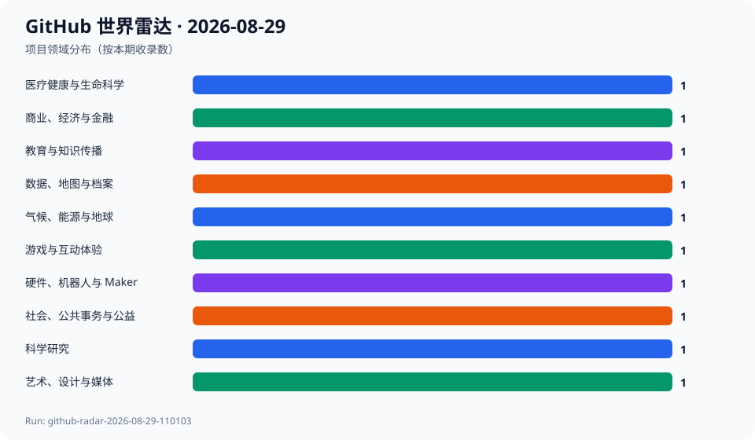
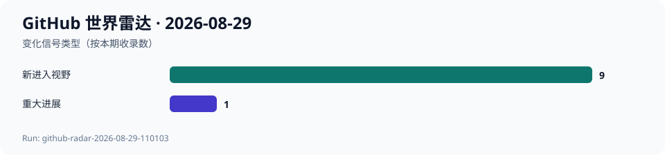

# GitHub 世界雷达 · 2026-08-29

> 生成时间：`2026-08-29T11:58:31+08:00` · 观察窗口：`2026-07-30` 至 `2026-08-29` · Run：`github-radar-2026-08-29-110103`

本期通过 GitHub Trending、Search、REST API、Release、Commit、Issue 与 PR 审阅超过 100 个去重候选，最终选择 10 个项目、覆盖 10 个领域。过去 24 小时的显性事件包括 QGIS 4.2.2、Ghostfolio 3.63.0、OpenScience 2.0.53、Fastpotify 0.2.0 和 OpenPhantom Installer 1.1；更长期的信号则来自社区健康、能源开放数据、机器人操作研究与公民报修基础设施。除 Ghostfolio 因连续发布取得重大进展外，昨日项目没有足够强的新变化，本期不重复介绍；这不等同于降温。当前只有五次连续快照，仍不足以计算完整 7 日和 30 日 Star 增量，相关字段保持 null。

## 今日趋势

- 专业基础设施集中进入版本节点：QGIS 发布 4.2.2，Ghostfolio 在昨日 3.62.0 后紧接着发布 3.63.0。
- 科研与公共服务正在同时强化可复核流程：OpenScience 修复桌面安装更新，PUDL 持续校正能源数据加工，FixMyStreet 继续推进地方化落地。
- 软件正在更直接地连接现实行动：Community Health Toolkit 面向社区健康工作者，SuperDex 面向机器人接触操作研究，但两者都不能跳过医疗或物理世界验证。
- 数字保存与儿童科普构成两个意外发现：OpenPhantom 先交付合法零售版补丁而未夸大引擎完成度，史前动物馆继续修正双语移动体验。
- 年轻消费工具仍能形成清晰发布信号：Fastpotify 创建不足两天即发布 0.2.0，但账户、平台条款和早期稳定性仍是边界。
- 五次连续快照尚未覆盖完整 7 日；本期只记录可复核的一日差值和公开活动，不估算中期增长率。

## 跨领域发现

| 项目 | 领域 | 它是什么 | 为什么现在 | 信号 | 阶段 | 置信度 |
| --- | --- | --- | --- | --- | --- | --- |
| [synthetic-sciences/openscience](../projects/synthetic-sciences--openscience.md) | 科学研究 | 项目方称其为面向科学研究的开源 AI 工作台，可覆盖文献检索、假设、代码、实验与写作。 | 2026-08-28 发布 v2.0.53，并在一小时内继续修复 macOS 桌面安装和更新；项目创建约八周已达到 3352 Star。 | 推断：科研 Agent 正从提示词演示走向桌面工作台和持续交付，但安装便利并不等于研究结果可信。 | 快速成长 | 中 |
| [medic/cht-core](../projects/medic--cht-core.md) | 医疗健康与生命科学 | 项目方称 Community Health Toolkit 核心框架用于构建离线优先、移动优先的社区健康应用。 | 2026-08-28 将 minor version 从 5.2 提升到 5.3，并继续修复并行 XForm transform 等运行问题，显示新版本周期已经启动。 | 推断：面向社区健康工作者的软件仍把离线能力、表单执行与版本兼容作为核心基础设施问题。 | 成熟项目重新升温 | 高 |
| [catalyst-cooperative/pudl](../projects/catalyst-cooperative--pudl.md) | 气候、能源与地球 | 项目方称 PUDL 把美国政府公用事业和能源数据加工成可分析、可版本化的数据资源。 | 2026-08-28 更新测试重组后的文档，并持续处理发电燃料多年度分配错误和 NREL ATB 新分区格式，直接影响能源数据复现。 | 推断：气候与能源研究的关键进展常来自数据口径、版本和 ETL 修正，而不是新的可视化界面。 | 稳定发展 | 高 |
| [qgis/QGIS](../projects/qgis--QGIS.md) | 数据、地图与档案 | 项目方称 QGIS 是免费、开源、跨平台的完整 GIS，支持空间数据管理、制图和分析。 | 2026-08-28 发布 4.2.2，主线同日继续提交；3D 面积测量工具也在推进，形成明确的稳定版与后续演进信号。 | 推断：成熟地理信息基础设施仍在通过高频修订版和 3D 工作流扩展保持生命力。 | 成熟项目重新升温 | 高 |
| [ghostfolio/ghostfolio](../projects/ghostfolio--ghostfolio.md) | 商业、经济与金融 | 项目方称其为强调隐私、数据所有权与自托管的开源财富管理软件。 | 继 2026-08-27 的 3.62.0 后，2026-08-28 又发布 3.63.0，新增受限共享权限和实验性 MCP 投资组合活动工具，并修复不同数据源同名持仓计算。 | 推断：财富管理工具正同时扩展共享权限、Agent 接口和数据正确性，但连续快速发布也提高了升级审查需求。 | 稳定发展 | 高 |
| [facebookresearch/project_superdex](../projects/facebookresearch--project_superdex.md) | 硬件、机器人与 Maker | 项目方称 SuperDex 是统一灵巧操作研究平台，包含接触物理引擎、机器人 SDK、场景编辑器和 RL/MPC 接口。 | 仓库创建于 2026-08-20，2026-08-24 发布 v1.0.0，2026-08-29 仍有提交；九天内达到 397 Star。 | 推断：机器人研究工具正在把接触物理、实验创作和强化学习训练收束为同一平台，但模拟到现实的鸿沟仍然存在。 | 早期探索 | 高 |
| [OpenPhantom/OpenPhantom](../projects/OpenPhantom--OpenPhantom.md) | 游戏与互动体验 | 项目方称其当前提供 1999 年《Star Wars Episode I: The Phantom Menace》PC 版的现代 Windows 补丁与安装器，并计划长期重建引擎和编辑工具。 | 2026-08-28 发布 Installer 1.1，随后继续提交并更正测试状态；当前可用交付与未来引擎目标被明确分开。 | 推断：老游戏数字保存正在从零散补丁走向可版本化安装器和逆向文档，但版权边界与原始资产所有权仍是核心约束。 | 早期探索 | 高 |
| [crmne/fastpotify](../projects/crmne--fastpotify.md) | 艺术、设计与媒体 | 项目方称其为原生轻量 Spotify 客户端，支持本机播放、Spotify Connect、局域网发现和跨平台桌面。 | 仓库创建于 2026-08-27，次日发布 v0.2.0 并继续提交共享播放列表贡献者显示；不足两天达到 399 Star。 | 推断：桌面音乐体验仍有从 Web 壳回到原生、轻量和设备协同的需求，但它高度依赖平台服务。 | 快速成长 | 中 |
| [s010s/prehistoric-animal-museum](../projects/s010s--prehistoric-animal-museum.md) | 教育与知识传播 | 项目方称其为面向儿童和家长的中英双语 3D 史前动物博物馆，包含 18 个互动展项。 | 项目创建于 2026-08-04，当前达到 740 Star；2026-08-29 合并窄屏语言选择器修复，移动端和双语体验仍在快速打磨。 | 推断：浏览器 3D、双语内容和家庭引导正在组合成小型数字博物馆，但艺术重建与科学事实必须明确分层。 | 早期探索 | 中 |
| [mysociety/fixmystreet](../projects/mysociety--fixmystreet.md) | 社会、公共事务与公益 | 项目方称其为地图式公共问题报告平台，帮助居民上报坑洞、路灯等街道问题并路由至相应机构。 | 2026-08-28 继续更新测试基础设施，并推进 Dudley 地方前端，显示 16 年历史的公民科技平台仍在做具体地区落地。 | 推断：数字公共基础设施的价值不只体现在新版本，也体现在长期维护地方工作流、公开状态和机构接口。 | 成熟项目重新升温 | 高 |

