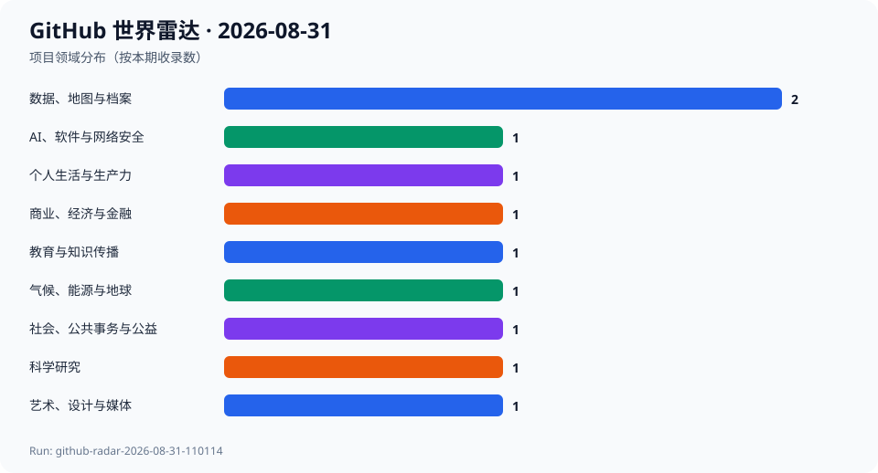
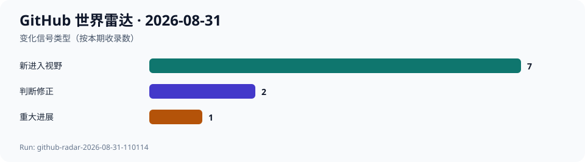

# GitHub 世界雷达 · 2026-08-31

> 生成时间：`2026-08-31T11:07:13+08:00` · 观察窗口：`2026-08-01` 至 `2026-08-31` · Run：`github-radar-2026-08-31-110114`

本期为 2026-08-31 的同日复核，更新同一个 data/runs/2026-08-31.json，不创建重复日报。早间因 8 月 30 日的延迟触发已完成跨领域发现，本轮是 11:01 的正常调度；两次都使用实际观察日期，不回填 8 月 30 日数据。运行日期、观测时间及历史快照比较使用 Asia/Shanghai；下文 Commit、PR、Release 的事件日期沿用 GitHub UTC，metrics 保留带 Z 的时间戳。按 prompts/daily.md 和配置 v1，使用 agent-reach 的 gh/Search/API 路由复核：早间候选池 114 个，本轮 14 组专题 Search 得到 83 个去重候选，两组不相加充当去重总量；覆盖科学、生命健康、气候、地理、教育、公共事务、金融、开放数据、文化、音乐游戏、硬件、生活、隐私与跨学科创作。本轮 Trending 网页读取返回403，采用可用的 Search 和项目原始 API；保留早间已核验的 10 个项目、9 个领域及 5/3/2 发现配比。当前 10 个默认分支最新提交均与早间相同，部分 Star/Fork 有小幅变化，不因此追加升温判断。重要更正：NCO 的 designated latest 接口指向 5.3.8，但全部 78 个非预发布版本按发布时间排序，最新为 2026-04-20 发布的 5.3.9；不是今天新发布。早间旧口径及原始指标保留在 Git commit 3dfa0bf，当前记录明确更正。今日首次收录的仓库仍有 8 个，但变化标签优先体现修正，现为 new 7、major_progress 1、previous_judgement_revised 2；本轮没有新增入选项目。观察背景为 8 月 1—31 日，重点事件来自 8 月 29—31 日；本轮仓库指标核验于 11:03，早间内容证据的原时间保留。历史最早为 8 月 25 日，没有匹配的 7/30 日端点，增量字段均为 null；两次观测差值明确标注日期。本轮未执行候选代码或安装候选依赖；置信度只指公开证据可核验程度，不是产品、医疗、金融或安全背书。

## 今日趋势

- 科学与文化相连：Stellarium 主线新增 Potawatomi 星空文化及编辑能力，ATON 继续改进大型三维遗产的分层访问；共同信号是让知识可持续解释与维护，不能把代码许可证扩展为文化素材授权。
- 旅行与地图服务相连：TREK v4.1.1 修复底图配置导致的行程阻断，TRIP 1.49.0 切换默认瓦片提供商。自托管旅行数据仍可能依赖外部地理服务，其可靠性、配额和条款需要单独管理。
- 开放记录与可靠表达相连：OpenCouncil 明确不把尚不可信的决议抽取写入元数据，mapshaper v0.7.56 在符号避碰时保留地域约束；机器可读和视觉易读都不能丢掉事实边界。
- 个人与专业工具都有实质维护：ezbookkeeping 主线新增移动现金流组件，homr 合入 AMD 识谱推理，NCO 修复气候时间序列错误处理；合并、正式发布与本轮实测必须分开表述。
- 持续性更新：deepseek-harness 发布 alpha.2，8 月 28—31 日两次观测间增加 4402 Star，但仍未经安全审计；史前动物馆移除固定展项口径。NCO 同日补充版本判断修正：指定 latest 为 5.3.8，按发布时间最新为 5.3.9，不将其误写成今天的新发布。

## 跨领域发现

| 项目 | 领域 | 它是什么 | 为什么现在 | 信号 | 阶段 | 置信度 |
| --- | --- | --- | --- | --- | --- | --- |
| [Stellarium/stellarium](../projects/Stellarium--stellarium.md) | 科学研究 | 项目方称其为免费开源桌面天文馆，可展示肉眼、双筒望远镜和天文望远镜所见的三维星空。 | 2026-08-30 合并 Potawatomi 星空文化包和 Sky Culture Maker 载入、编辑已有文化的能力；2026-08-31 仍有本地化提交。两个合并事件把新增文化内容与可持续编辑工具连接起来。 | 推断：科学可视化工具也能成为活态文化知识的保存与教学设施；同一片天空可以承载不同社群的解释，而非只有一套星座叙事。 | 稳定发展 | 高 |
| [nco/nco](../projects/nco--nco.md) | 气候、能源与地球 | 项目方称其提供 netCDF/HDF/DAP 科学数据命令行算子，用于统计、重映射、气候平均与元数据处理。 | 2026-08-30 的两个提交修复 ncremap/ncclimo 错误处理对常用命令的影响，最新提交针对时间序列命令误入错误处理器，涉及变量初始化和 shell 算术处理。 同日复核更正早间版本口径：/releases/latest 返回 5.3.8，但按全部非预发布版本的 published_at 排序，最新为 2026-04-20 发布的 5.3.9；这不是本日新增 Release。 | 推断：气候研究可重复性的基础条件，常藏在文件维度、时间切片和错误处理这些维护细节里；本次有实质修复证据，但没有爆红或数值精度提升的证据。 本次修正也说明接口指定的 latest 与按发布时间最新并不总是一致。 | 稳定发展 | 高 |
| [schemalabz/opencouncil](../projects/schemalabz--opencouncil.md) | 社会、公共事务与公益 | 项目方称其将市政会议转为可搜索的转录和摘要，帮助公民理解地方治理，由 Schema Labs 非营利组织开发。 | 2026-08-30 合并服务端议题内容、机器可读元数据及授权内部模块边界修复；2026-08-29 已增加有转录但无摘要的明确状态。PR #699 特别说明决议与投票数据不写入元数据，因为抽取链尚未充分可信。 | 推断：公共记录工具正在同时改善可访问性与可信边界；能被机器读取，还应说明处理状态、来源和哪些推断不能成为官方事实。 | 稳定发展 | 高 |
| [liketrek/TREK](../projects/liketrek--TREK.md) | 个人生活与生产力 | 项目方称其为可自托管、实时协作的旅行规划器，结合地图、预算、清单和旅行日记。 | 2026-08-29 发布 v4.1.1，修复 v4.1.0 默认矢量底图缺少 zoom 上限导致行程页与地图设置打不开的阻断故障，并处理地点重复判断和住宿日历问题。 | 推断：旅行记录可自托管，底图与地理编码仍依赖外部服务；TREK 修复与 TRIP 1.49.0 切换默认瓦片提供商的同期事件，提示应将这些依赖视为产品可靠性的一部分。 | 快速成长 | 高 |
| [mayswind/ezbookkeeping](../projects/mayswind--ezbookkeeping.md) | 商业、经济与金融 | 项目方称其为轻量自托管个人账本，支持桌面与移动端、多币种、交易导入导出及图表。 | 2026-08-30 主线新增移动端月支出进度、期间净收入和储蓄率组件。最新正式版仍是 2026-07-20 的 v1.6.1，不能把这些主线功能当作已正式发布。 | 推断：记账工具正从收集交易扩展到手机端可理解的现金流反馈；社区对确定性本地分类的请求，也显示自动化与把私人账单发给模型并非同义词。 | 稳定发展 | 高 |
| [mbloch/mapshaper](../projects/mbloch--mapshaper.md) | 数据、地图与档案 | 项目方称其为地图数据编辑工具，支持常见空间数据格式、简化、属性编辑、裁剪与筛选。 | 2026-08-30 发布 v0.7.56，增加圆形地图符号避碰 -repel 及 polygons= 约束，使符号中心可以在避让时保持在原多边形内；相应提交包含测试改动。 | 推断：数据地图正在把视觉可读性与空间语义一起设计；避免圆点重叠的同时保留地域归属，有助于公共数据与数据新闻更诚实地表达位置。 | 稳定发展 | 高 |
| [liebharc/homr](../projects/liebharc--homr.md) | 艺术、设计与媒体 | 项目方称其能把纸质乐谱图像转换为可编辑的 MusicXML，并提供在线示例及关联的移动端项目。 | 2026-08-31 合并 AMD GPU 推理支持 PR #143，扩展图像分割和乐谱识别后端并重组 Docker 环境；README 已列 CPU、CUDA、ROCm 三种选择。 | 推断：音乐档案正从扫描图像保存走向可编辑的结构化乐谱；更多硬件选择可能降低处理门槛，但不能据合并记录推断识别质量和普及率。 | 稳定发展 | 高 |
| [phoenixbf/aton](../projects/phoenixbf--aton.md) | 数据、地图与档案 | 项目方称其为面向文化遗产的跨设备 Web3D/WebXR 框架，支持空间标注、协作、3D Tiles 和 Gaussian Splats。 | 2026-08-29 至 30 日继续调整多分辨率加载与渲染；最新提交涉及祖先瓦片加载、下载和解析队列、导航时调度，以及 3DGS 依赖，并非只有版本号变动。 | 推断：文化遗产数字保存需要从模型采集延伸到分层访问、空间标注与多人解释；102 Star 的长期项目也可能承载普通热门榜忽略的专业基础设施。 | 稳定发展 | 高 |
| [s010s/prehistoric-animal-museum](../projects/s010s--prehistoric-animal-museum.md) | 教育与知识传播 | 项目方称其为供儿童与家长共同探索的中英双语 3D 史前动物馆；本期不再把固定展项数作为持续性描述。 | 2026-08-30 合并 PR #15，移除英文及中文 README 中固定展项数量，以适应后续扩展。2026-08-29 日报引用的“18 个展项”保留为当时项目方声明，不代表今天的固定规模；本次未独立清点运行时展项。 | 推断：数字科普内容需要像软件一样维护可变口径与素材授权边界；家庭友好的交互目标和科学、版权准确性应共同评估。 | 早期探索 | 高 |
| [deepseek-ai/deepseek-harness](../projects/deepseek-ai--deepseek-harness.md) | AI、软件与网络安全 | 项目方称其为采用一切皆插件架构的开源 Agent 运行环境，目前仍处于开发者预览。 | 2026-08-30 发布 dsh-v0.1.2-alpha.2，增加连接异常提示、自动重试和活动计划查看，并修复启动兼容问题。相较 2026-08-28 最近一次收录，Star 从 200560 增至 204962、Fork 从 22942 增至 23739。 | 推断：关注度正在伴随可见的发布节奏转化为连接可靠性和会话可观测性的迭代；预发布活跃不能等同于安全或生产成熟。 | 快速成长 | 高 |

