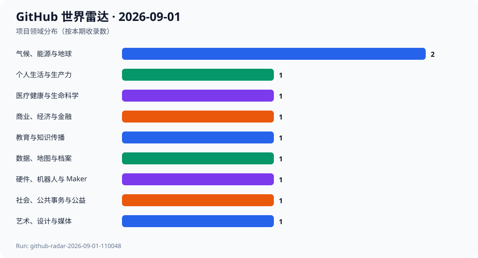
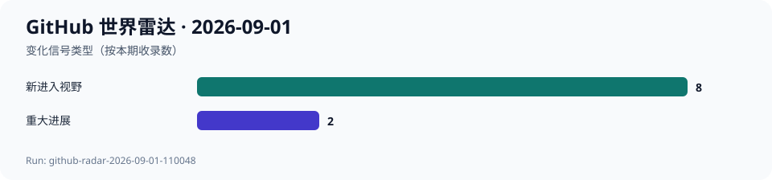

# GitHub 世界雷达 · 2026-09-01

> 生成时间：`2026-09-01T11:10:00+08:00` · 观察窗口：`2026-08-02` 至 `2026-09-01` · Run：`github-radar-2026-09-01-110048`

本期使用 agent-reach 的 GitHub/gh 路由，以 GitHub Search、仓库 API、默认分支 Commit、完整分页 Release 列表、Issue/PR 和 README 建立跨领域候选池。主流程的专题 Search 已返回超过 60 个候选，三个分域只读检索又分别形成 16、17、15 个有效候选；这些集合存在交集，不相加冒充去重总量。GitHub Search 的分钟额度在检索中一度耗尽，但 Core API 保持可用，最终 10 个项目均由 Core API 和直接资料复核。运行日期、观察时间和历史比较使用 Asia/Shanghai；Commit、PR、Release 事件时间沿用 GitHub UTC。最终选择 10 个项目、9 个领域，发现配比为 established_momentum 5、overlooked_cross_domain 3、surprising_and_experimental 2，同一领域最多 2 个；没有 AI 项目入选。相对 2026-08-31，8 个项目首次进入历史，PUDL 和 Patternflow 因新事件重新进入并标为重大进展；上一期 10 个项目本期没有同等强的新事件，退出当日精选但历史不删除，也不据此判断项目转差。历史最早为 2026-08-25，但当前入选项目没有精确匹配的 7 日或 30 日端点，因此增长字段保持 null；Patternflow 的 6 日差值和 PUDL 的 3 日差值只作为注明日期的代理信号。README 自述均标为项目方声明；本轮未执行候选仓库代码或安装其依赖。

## 今日趋势

- 公共数据工具正在把来源、缺失和修订历史变成产品能力：PySUS 明确拆分公共卫生数据源，PUDL 处理不完整监管申报并清除陈旧加工文件。
- 成熟基础设施的新价值常来自边界条件：Organic Maps 修复反日界线视口搜索，Payu 为高成本气候模拟补上 restart 防覆盖和最小溯源。
- 隐私工具正从安全主张继续走向日常可用性：Ente 增加多相册幻灯片；Actual 的 26.9.0 已进入主分支，但正式 Release 尚未出现。
- 开放创作工具同时面对体验和发布可信度：Graphite 改善画笔视口缩放，Patternflow 修正固件自报版本并保留软件、硬件的不同许可证。
- 低热度仓库也在扩展公共知识边界：Badger Politics 把地方议会投票纳入可溯源记录，CDS 课程把 FAIR 天文数据发布连接到研究者教育。

## 跨领域发现

| 项目 | 领域 | 它是什么 | 为什么现在 | 信号 | 阶段 | 置信度 |
| --- | --- | --- | --- | --- | --- | --- |
| [AlertaDengue/PySUS](../projects/AlertaDengue--PySUS.md) | 医疗健康与生命科学 | 项目方称其用于下载、清理和分析巴西统一卫生系统的开放数据，并统一访问 DATASUS、dados.gov.br、OpenDataSUS 等来源。 | 2026-09-01 发布 2.11.0；相邻提交把不同公共卫生数据源拆成显式模块，使调用者可以辨认数据来自哪个系统，而不是把所有数据隐藏在一个入口后。 | 推断：公共卫生数据工具的竞争点正在从能否下载，转向来源是否可见、数据质量是否可解释以及查询过程能否复核。 | 稳定发展 | 高 |
| [actualbudget/actual](../projects/actualbudget--actual.md) | 商业、经济与金融 | 项目方称 Actual 是 local-first 的开源个人财务与预算工具，支持设备同步和自托管。 | 2026-09-01 默认分支合并 26.9.0 版本与发布说明。观察时完整 GitHub Release 列表的最新正式版仍是 2026-08-07 的 v26.8.1，因此这里只确认发布准备进入主分支，不声称 26.9.0 已正式发布。 | 推断：个人财务工具继续把本地数据控制、跨设备体验和可自托管部署结合起来；清楚区分主分支版本提交与正式发布也是可靠跟踪的一部分。 | 稳定发展 | 高 |
| [organicmaps/organicmaps](../projects/organicmaps--organicmaps.md) | 数据、地图与档案 | 项目方称 Organic Maps 是基于 OpenStreetMap 的 Android 与 iOS 离线地图应用，并主张无广告、无追踪和不收集数据。 | 2026-08-31 合并的搜索修复覆盖视口搜索与反日界线组合场景，并修改经纬度投影与测试；这类跨越正负 180 度经线的边界问题会直接影响跨太平洋区域的搜索正确性。 | 推断：成熟地图产品的可靠性不仅来自更多地点数据，也来自对地球坐标边界、离线状态和移动端交互的长期处理。 | 稳定发展 | 高 |
| [ente/ente](../projects/ente--ente.md) | 个人生活与生产力 | 项目方称 Ente 是端到端加密的开源服务集合，包含照片、敏感文档存储和身份验证产品。 | 2026-08-31 移动端照片应用新增对多个已选相册播放幻灯片，直接改善加密照片库的日常浏览体验；同日服务端还合入不透明会话标识。 | 推断：隐私产品正在从安全主张继续走向普通用户可感知的相册体验；安全与可用性不必被当成二选一。 | 稳定发展 | 高 |
| [GraphiteEditor/Graphite](../projects/GraphiteEditor--Graphite.md) | 艺术、设计与媒体 | 项目方称 Graphite 是社区构建的二维内容创作应用，把图层式设计与节点式程序化图形结合起来。 | 2026-08-31 画笔工具新增 Scale with Viewport 选项，使笔刷尺寸可以选择是否随视口缩放；这是直接影响创作手感的用户可见改动。 | 推断：开源创作工具正在把传统绘画交互和程序化图形系统放进同一个工作流，而近期进展已经落到细致的画笔行为。 | 早期探索 | 高 |
| [payu-org/payu](../projects/payu-org--payu.md) | 气候、能源与地球 | 项目方称 Payu 是在澳大利亚 NCI 超级计算环境运行数值气候模型的工作流工具。 | 2026-08-31 至 09-01 新增 restart 最小溯源、run 到 collate/postscript/sync 的依赖链，并在 repeat 模式检查已有 restart，避免长任务恢复时覆盖既有状态。 | 推断：高成本气候模拟的可靠性不只取决于模型方程，也取决于任务能否恢复、产物能否追溯以及后处理依赖是否明确。 | 稳定发展 | 高 |
| [catalyst-cooperative/pudl](../projects/catalyst-cooperative--pudl.md) | 气候、能源与地球 | 项目方称 PUDL 将美国公共事业和能源系统数据整理为可分析数据，服务气候倡议者、研究者、政策制定者和记者。 | 2026-08-31 合并 FERC EQR 数据正确性修复：允许不完整或不可解析的申报、保留 ENUM 类型、清除归档刷新后遗留的陈旧 Parquet，并补充季度提取统计和测试。 | 推断：能源开放数据的关键进展常是诚实处理缺失、损坏和旧缓存，而不是简单增加数据量；错误状态可见才能支撑可复核分析。 | 稳定发展 | 高 |
| [cds-astro/a-FAIR-journey-for-astronomical-data](../projects/cds-astro--a-FAIR-journey-for-astronomical-data.md) | 教育与知识传播 | 项目方称这是面向天文学研究者的开放科学课程，介绍如何通过 CDS VizieR 发布 FAIR 数据并接入欧洲开放科学云。 | 2026-09-01 课程工作环境 Docker 更新至 v0.2.8；事件本身是教学运行环境维护，但它让科学数据发布、长期保存和研究者教育出现在同一个可复现工作台中。 | 推断：开放科学不只需要仓库和数据集，还需要教研究者如何描述、发布、发现和复用数据的持续课程基础设施。 | 稳定发展 | 中 |
| [uprightsleepy/badger-politics](../projects/uprightsleepy--badger-politics.md) | 社会、公共事务与公益 | 项目方称其从官方记录重建威斯康星州法案、投票、听证、竞选资金、游说及地方议会数据，并保留来源链接。 | 2026-09-01 新增 Milwaukee 与 West Allis 市议会投票数据，随后修复议会页面的移动端溢出并加入测量脚本；项目把州级政治记录向地方议会延伸。 | 推断：公共问责工具正在把细粒度地方投票与州级记录放进同一可查询历史，同时尝试以静态站点和设备侧个性化降低集中式跟踪。 | 早期探索 | 中 |
| [engmung/Patternflow](../projects/engmung--Patternflow.md) | 硬件、机器人与 Maker | 项目方称 Patternflow 是开放的 LED 合成器，以旋钮实时生成灯光图案，并公开原理图、固件、3D 模型和制作指南。 | 2026-08-31 发布 v3.8.0，随后发现音频版固件仍自报旧版本；2026-09-01 修正版本定义，并在发布脚本中检查构建产物是否包含准确版本字符串。 | 推断：开放硬件的发布可信度既包括电路和外壳能否复现，也包括货架版本、固件自报版本和二进制产物能否一致。 | 快速成长 | 高 |

