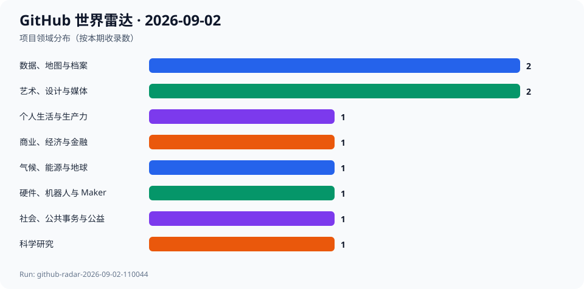
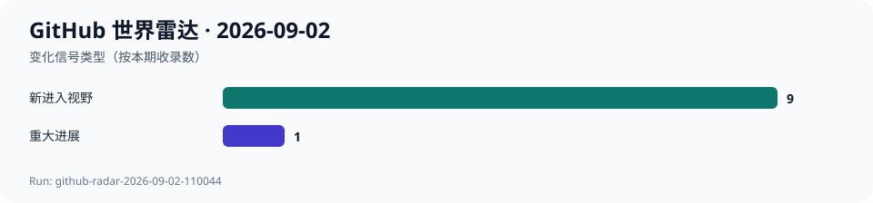

# GitHub 世界雷达 · 2026-09-02

> 生成时间：`2026-09-02T11:12:00+08:00` · 观察窗口：`2026-08-03` 至 `2026-09-02` · Run：`github-radar-2026-09-02-110044`

本期使用 agent-reach 的 GitHub/gh 路由，按科学、气候、公共事务、教育、金融、地图、音乐、硬件、隐私和创作十组实时 Search 建池，再以仓库 API、默认分支 Commit、完整 Release 列表和 README 复核。最终选取10个项目、8个领域，配比为5个明确势头、3个跨领域潜力、2个意外发现；没有让 AI/LLM 占满结果。本期指标核验于北京时间11:00至11:12；GitHub 事件日期为UTC。相对9月1日，GeoLibre 是有实质修复的再入选项目；其余9项首次进入日报。7日/30日没有对全部入选项目都匹配的同一repo历史端点，均为null；未执行候选代码或安装依赖。

## 今日趋势

- 科学计算与地球系统工具仍在解决具体可靠性：数值核函数、氧气溶解度和大TIFF元数据。
- 个人数据产品把本地优先、浏览器端处理和音乐库同步落在日常任务中。
- 低热度公共事务与创作实验仍值得保留，但必须与成熟度和许可证风险分开。
- 硬件和空间数据的可用性取决于真实数据、版本和边界条件，而非单一热度。

## 跨领域发现

| 项目 | 领域 | 它是什么 | 为什么现在 | 信号 | 阶段 | 置信度 |
| --- | --- | --- | --- | --- | --- | --- |
| [ml-rust/numr](../projects/ml-rust--numr.md) | 科学研究 | 项目方称其为受NumPy启发、支持GPU加速的Rust数值计算库。 | 2026-09-02新增注册缓存的单遍CUDA RMSNorm核函数，v0.7.0于8月30日正式发布。 | 推断：科学计算基础库继续把性能优化下沉到可复用算子。 | 早期探索 | 高 |
| [OceanBioME/OceanBioME.jl](../projects/OceanBioME--OceanBioME.jl.md) | 气候、能源与地球 | 项目方称其用于耦合海洋生物地球化学、碳酸盐化学与物理过程的建模。 | 9月1日合并氧气溶解度拼写修正，最新正式版v0.18.2为8月24日。 | 推断：地球系统模型的细小物理化学参数维护也会影响后续研究可复核性。 | 稳定发展 | 高 |
| [PetoiCamp/OpenCat-Quadruped-Robot](../projects/PetoiCamp--OpenCat-Quadruped-Robot.md) | 硬件、机器人与 Maker | 项目方称其为面向STEM、DIY和研究的开源四足机器人框架。 | 9月2日主线更新项目成长说明；虽不是固件发布，仓库仍是开放消费级机器人社区的重要样本。 | 推断：机器人教育的价值在于硬件、运动控制和课程社区能否共同复现。 | 稳定发展 | 中 |
| [Aurtechmx/openlidarviewer](../projects/Aurtechmx--openlidarviewer.md) | 数据、地图与档案 | 项目方称其为完全在浏览器本地运行的LiDAR与点云查看器。 | 9月2日修正按面密度分层平面扫描的逻辑，v0.6.7于8月29日发布。 | 推断：空间数据工具正把本地处理、可视化和隐私边界放进浏览器。 | 早期探索 | 高 |
| [mithun-srinivas/DoxDock](../projects/mithun-srinivas--DoxDock.md) | 个人生活与生产力 | 项目方称其为100%浏览器内运行、无上传的离线优先PDF和图像工具。 | 9月2日发布v1.13.0。 | 推断：轻量日常文档处理正把隐私和无需账户作为产品体验的一部分。 | 早期探索 | 高 |
| [mike840609/assets_tracker](../projects/mike840609--assets_tracker.md) | 商业、经济与金融 | 项目方称其为开源自托管的净资产与投资组合跟踪器。 | 9月2日修复定投价格陈旧时的跳过或重新抓取逻辑。 | 推断：个人金融软件的可靠性很大程度取决于价格数据陈旧时是否明确处理。 | 早期探索 | 高 |
| [ahnafnafee/songmirror](../projects/ahnafnafee--songmirror.md) | 艺术、设计与媒体 | 项目方称其可在多种音乐服务与Jellyfin间自托管同步播放列表。 | 9月2日合并Spotify音乐库行跳过修复。 | 推断：跨平台音乐库的真实难点在匹配、同步与服务边界。 | 早期探索 | 中 |
| [opengeos/GeoLibre](../projects/opengeos--GeoLibre.md) | 数据、地图与档案 | 项目方称其为可在浏览器、桌面、移动端和Jupyter运行的轻量云原生GIS平台。 | 9月2日修复大TIFF元数据加载，v2.8.0于8月27日发布；这是相对历史记录的实质再入选。 | 推断：空间数据平台的可用性取决于真实大文件与元数据边界。 | 快速成长 | 高 |
| [civic-dashboard/civic-dashboard-web](../projects/civic-dashboard--civic-dashboard-web.md) | 社会、公共事务与公益 | 项目方称其旨在让多伦多民主信息更容易获取。 | 9月2日新增每周数据概览推送；低热度项目仍在维护公共事务可见性。 | 推断：公共事务工具的长期价值取决于能否持续、可理解地发布信息。 | 早期探索 | 中 |
| [zz-plant/stims](../projects/zz-plant--stims.md) | 艺术、设计与媒体 | 项目方称其是浏览器原生、受MilkDrop启发的WebGL音乐可视化器。 | 9月2日更新架构提案并修正架构检查声明。 | 推断：小型创作工具也开始把架构可解释性作为可维护性的一部分。 | 概念实验 | 中 |

