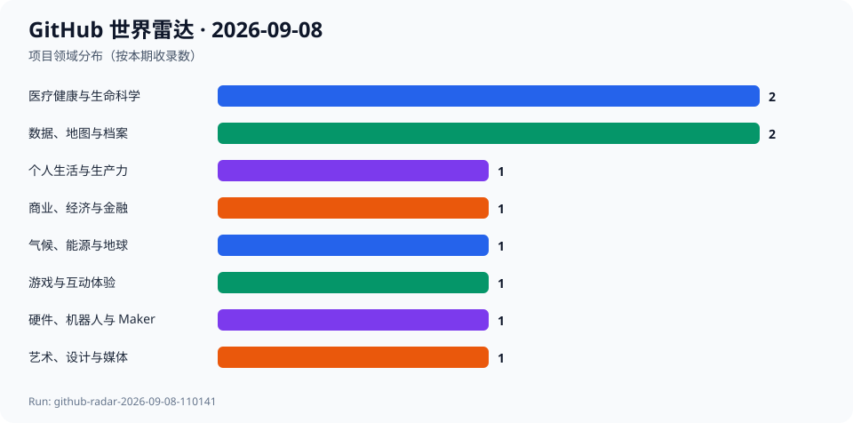

# GitHub 世界雷达 · 2026-09-08

> 生成时间：`2026-09-08T11:05:15+08:00` · 观察窗口：`2026-08-09` 至 `2026-09-08` · Run：`github-radar-2026-09-08-110141`

本期在北京时间11:01至11:05通过 GitHub Search 与仓库、Commit、Release、License API 建池和复核；agent-reach 本机入口因解释器缺失不可运行，故未将其输出作为证据。9月3日至7日没有运行事实源，本次以9月8日为补档后的新观察点：选取10个项目、7个领域，含5个明确势头、3个跨领域潜力和2个意外发现。所有当前指标均为本次快照；没有同一repo的连续7日或30日端点时增长值为null；未执行候选代码或安装依赖。

## 今日趋势

- 健康数据平台与可穿戴数据汇聚同时活跃，互操作性在扩展时必须和临床、隐私边界一起审视。
- 开放数据门户从目录系统走向面向任务的门户框架，数据来源与许可仍是可信度核心。
- 面向家庭能源、个人媒体和驾驶辅助的开源项目把控制权带回本地，但安全与合规风险不能由热度替代。
- 气候技术目录与游戏开发资源库说明：知识索引本身也是跨领域基础设施。

## 跨领域发现

| 项目 | 领域 | 它是什么 | 为什么现在 | 信号 | 阶段 | 置信度 |
| --- | --- | --- | --- | --- | --- | --- |
| [medplum/medplum](../projects/medplum--medplum.md) | 医疗健康与生命科学 | 项目方声明：这是帮助开发合规医疗应用的医疗平台。 | 主分支最近提交为2026-09-07，最新发布为2026-09-04，且本次快照显示仓库仍在活跃维护。 | 推断：健康应用的开放基础设施正在把互操作性与工程迭代放在同一条链上。 | 稳定发展 | 高 |
| [the-momentum/open-wearables](../projects/the-momentum--open-wearables.md) | 医疗健康与生命科学 | 项目方声明：这是把可穿戴健康数据汇聚到统一、可自托管API的平台。 | 主分支最近提交为2026-09-07，最近发布为2026-08-12；本次快照为2470 Stars。 | 推断：消费者健康数据的价值正在从单一设备转向可迁移的数据接口。 | 快速成长 | 高 |
| [protontypes/open-sustainable-technology](../projects/protontypes--open-sustainable-technology.md) | 气候、能源与地球 | 项目方声明：这是关于气候、可持续能源、生物多样性和自然资源开源生态的目录与分析。 | 最近提交与发布都在2026-09-01，本次快照为2547 Stars。 | 推断：面对分散的气候技术，发现、许可与采用路径的索引同样是基础设施。 | 稳定发展 | 高 |
| [ckan/ckan](../projects/ckan--ckan.md) | 数据、地图与档案 | 项目方声明：CKAN 是用于数据中心与数据门户的开源数据管理系统。 | 最近主线提交为2026-09-02，最新发布为2026-08-26；本次快照为5109 Stars。 | 推断：成熟开放数据基础设施仍通过持续维护承接公共数据发布。 | 稳定发展 | 高 |
| [datopian/portaljs](../projects/datopian--portaljs.md) | 数据、地图与档案 | 项目方声明：这是构建数据门户的框架，可连接CKAN、GitHub和Frictionless等后端。 | 主分支最近提交为2026-09-07；本次快照为2349 Stars。 | 推断：数据门户正从静态展示转向以提问、加载和行动为中心的工作流。 | 快速成长 | 高 |
| [navidrome/navidrome](../projects/navidrome--navidrome.md) | 艺术、设计与媒体 | 项目方声明：这是个人音乐流媒体服务。 | 主分支最近提交为2026-09-07；本次快照为23397 Stars。 | 推断：自托管媒体服务仍是个人数字收藏与平台化分发之间的替代路径。 | 稳定发展 | 高 |
| [commaai/openpilot](../projects/commaai--openpilot.md) | 硬件、机器人与 Maker | 项目方声明：openpilot 是面向机器人系统、可升级部分车辆驾驶辅助的操作系统。 | 主分支最近提交为2026-09-08，本次快照为63597 Stars。 | 推断：开放驾驶辅助的影响力来自真实硬件、车辆支持范围和持续维护的组合。 | 稳定发展 | 高 |
| [juspay/hyperswitch](../projects/juspay--hyperswitch.md) | 商业、经济与金融 | 项目方声明：这是可组合的开源支付平台，覆盖支付、付款、风控和对账等连接。 | 主分支最近提交为2026-09-07，仓库更新时间到2026-09-08；本次快照为43591 Stars。 | 推断：支付基础设施的竞争点正包括连接编排和可观测性，而不仅是单一通道。 | 快速成长 | 高 |
| [make-all/tuya-local](../projects/make-all--tuya-local.md) | 个人生活与生产力 | 项目方声明：该项目为Home Assistant提供Tuya设备的本地支持。 | 主分支最近提交为2026-09-07，最近发布为2026-09-03；本次快照为3425 Stars。 | 推断：家庭设备的本地控制同时关联便利、能源可见性和云依赖的替代。 | 稳定发展 | 高 |
| [ellisonleao/magictools](../projects/ellisonleao--magictools.md) | 游戏与互动体验 | 项目方声明：这是面向游戏开发的资源清单。 | 最近主线提交为2026-09-01，仓库于2026-09-08更新；本次快照为17262 Stars。 | 推断：跨引擎、跨媒介的资源地图仍能降低创作与学习的发现成本。 | 稳定发展 | 中 |

