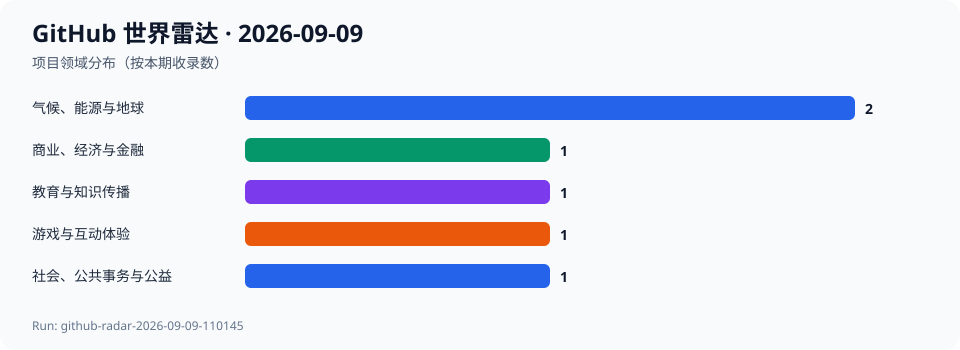
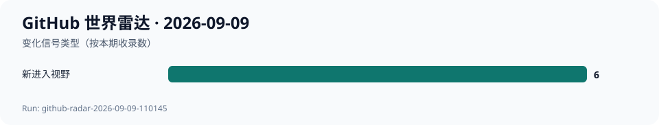

# GitHub 世界雷达 · 2026-09-09

> 生成时间：`2026-09-09T11:04:22+08:00` · 观察窗口：`2026-08-10` 至 `2026-09-09` · Run：`github-radar-2026-09-09-110145`

本期在北京时间11:01至11:04以 GitHub Search、仓库 API、默认分支 Commit、Release 和 License 端点建立并复核候选池。agent-reach 的本机入口仍因解释器缺失不可运行，故实际检索使用其 GitHub/gh 路由规定的 gh CLI；没有使用模型记忆补全事实。最终收录6个项目、5个领域，按3个明确势头、2个跨领域潜力、1个意外发现组织。相对9月8日均为新进入视野；没有可复核的同repo 7日或30日快照，增长数均为null；未执行候选代码或安装依赖。

## 今日趋势

- 能源转型的开源基础设施同时需要电力系统模型与可追溯的真实数据解析。
- 参与式民主软件和免费课程都把公共能力沉淀为可维护的数字基础设施。
- 个人财务与游戏收藏的聚合工具提醒我们：第三方连接、隐私和许可是体验的一部分。

## 跨领域发现

| 项目 | 领域 | 它是什么 | 为什么现在 | 信号 | 阶段 | 置信度 |
| --- | --- | --- | --- | --- | --- | --- |
| [PyPSA/PyPSA](../projects/PyPSA--PyPSA.md) | 气候、能源与地球 | 项目方声明：PyPSA 是用于电力系统分析的 Python 工具。 | 主分支最新提交为2026-09-08，最新发布为2026-08-19，本次快照为2132 Stars。 | 推断：能源转型讨论需要可复核的系统级建模工具，而不只是单点设备叙事。 | 稳定发展 | 高 |
| [electricitymaps/electricitymaps-contrib](../projects/electricitymaps--electricitymaps-contrib.md) | 气候、能源与地球 | 项目方声明：这是为 Electricity Maps 平台提供电力数据解析器的开源仓库。 | 主分支最新提交为2026-09-07，本次快照为4032 Stars。 | 推断：碳强度等公共指标的可信度依赖可审查的数据接入与解析维护。 | 稳定发展 | 高 |
| [consuldemocracy/consuldemocracy](../projects/consuldemocracy--consuldemocracy.md) | 社会、公共事务与公益 | 项目方声明：Consul Democracy 是开源的电子参与和开放政府软件。 | 主分支最新提交为2026-09-07，最新发布为2026-09-02，本次快照为1548 Stars。 | 推断：参与式公共服务需要持续的软件维护与治理，而非一次性的在线投票界面。 | 稳定发展 | 高 |
| [freeCodeCamp/freeCodeCamp](../projects/freeCodeCamp--freeCodeCamp.md) | 教育与知识传播 | 项目方声明：这是免费学习数学、编程和计算机科学的开源课程与代码库。 | 主分支最新提交为2026-09-08，本次快照为455239 Stars。 | 推断：大规模开放课程的价值来自内容、练习和社区维护的长期协同。 | 稳定发展 | 高 |
| [firefly-iii/firefly-iii](../projects/firefly-iii--firefly-iii.md) | 商业、经济与金融 | 项目方声明：Firefly III 是个人财务管理工具。 | 主分支最新提交为2026-09-08，本次快照为24551 Stars。 | 推断：个人财务工具的开放性可提高可迁移性，但不会消除数据质量与安全责任。 | 稳定发展 | 高 |
| [JosefNemec/Playnite](../projects/JosefNemec--Playnite.md) | 游戏与互动体验 | 项目方声明：Playnite 把第三方游戏库与模拟器整合到统一界面。 | 本次快照为13916 Stars；虽然最新主线提交为2026-08-31且发布为2026-05-26，2026-09-08仓库仍有更新信号，故作为低置信度的观察项而非势头结论。 | 推断：个人数字游戏收藏的组织仍依赖跨平台元数据与服务边界。 | 稳定发展 | 中 |

