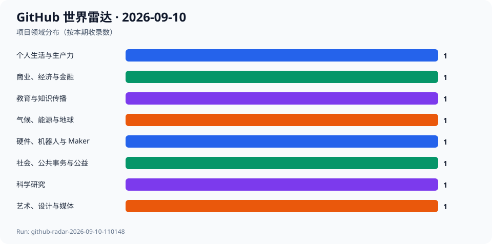

# GitHub 世界雷达 · 2026-09-10

> 生成时间：`2026-09-10T11:03:04+08:00` · 观察窗口：`2026-08-11` 至 `2026-09-10` · Run：`github-radar-2026-09-10-110148`

本期在北京时间11:01至11:03以 GitHub Search、仓库 API、默认分支 Commit、Release 和 License 端点完成真实检索与复核。agent-reach 本机入口因解释器缺失不可运行，故使用其 GitHub/gh 路由规定的 gh CLI；没有以模型记忆补全事实。最终收录8个项目、8个领域：4个明确势头、2个跨领域潜力和2个意外发现。PUDL为相对9月1日的重大进展，其余为新进入视野；没有可复核的同repo 7日或30日端点，增长数均为null；未执行候选代码或安装依赖。

## 今日趋势

- 开源能源数据、隐私分析和安全硬件把可审计性放到具体数据链路与设备边界。
- 公共参与、离线教育与企业协作工具显示数字公共能力依赖持续维护。
- 个人音乐服务和科学计算仍在从通用基础设施中获得新的可用性。

## 跨领域发现

| 项目 | 领域 | 它是什么 | 为什么现在 | 信号 | 阶段 | 置信度 |
| --- | --- | --- | --- | --- | --- | --- |
| [JuliaLang/julia](../projects/JuliaLang--julia.md) | 科学研究 | 项目方声明：Julia 是一门面向高性能技术计算的编程语言。 | 主分支最新提交为2026-09-09，最新发布为2026-08-16；本次快照为49084 Stars。 | 推断：科学计算生态的核心竞争力仍来自语言、数值库和可复现工作流的共同演进。 | 稳定发展 | 高 |
| [catalyst-cooperative/pudl](../projects/catalyst-cooperative--pudl.md) | 气候、能源与地球 | 项目方声明：PUDL 为倡议者、研究者、政策制定者和记者提供可分析的能源系统数据。 | 相对9月1日记录，主分支出现2026-09-10新提交；本次快照为605 Stars。 | 推断：能源转型研究的可复核性依赖把分散公用事业数据变成可审计的共同底座。 | 稳定发展 | 高 |
| [iiab/iiab](../projects/iiab--iiab.md) | 教育与知识传播 | 项目方声明：Internet-in-a-Box 可在 Raspberry Pi 上构建离线的“亚历山大图书馆”。 | 主分支最新提交为2026-09-10，本次快照为1951 Stars。 | 推断：离线知识基础设施仍是网络受限地区的现实教育选项。 | 稳定发展 | 高 |
| [decidim/decidim](../projects/decidim--decidim.md) | 社会、公共事务与公益 | 项目方声明：Decidim 是参与式民主框架。 | 开发分支最新提交为2026-09-09，本次快照为1812 Stars。 | 推断：参与式治理软件的价值在于流程透明、实施组织和持续维护的组合。 | 稳定发展 | 高 |
| [frappe/erpnext](../projects/frappe--erpnext.md) | 商业、经济与金融 | 项目方声明：ERPNext 是开源企业资源计划软件。 | 开发分支提交和最新发布均在2026-09-09，本次快照为39068 Stars。 | 推断：通用业务系统的开放性带来可定制性，也要求更严格的权限、流程与迁移治理。 | 稳定发展 | 高 |
| [koel/koel](../projects/koel--koel.md) | 艺术、设计与媒体 | 项目方声明：Koel 是音乐流媒体解决方案。 | 主分支提交和最新发布均在2026-09-09，本次快照为17241 Stars。 | 推断：个人媒体服务的竞争不只在播放体验，也在收藏、访问控制和平台依赖。 | 稳定发展 | 高 |
| [tillitis/tillitis-key1](../projects/tillitis--tillitis-key1.md) | 硬件、机器人与 Maker | 项目方声明：这是 TKey 开放USB安全密钥的 FPGA Verilog 与固件。 | 主分支最新提交为2026-09-09，本次快照为442 Stars。 | 推断：可检查的安全硬件把信任边界延伸到固件与可复现制造。 | 早期探索 | 中 |
| [plausible/analytics](../projects/plausible--analytics.md) | 个人生活与生产力 | 项目方声明：Plausible 是可自托管、无Cookie的隐私优先网页分析工具。 | 主分支最新提交为2026-09-09，本次快照为29000 Stars。 | 推断：分析产品可以将隐私约束作为默认设计，而非事后合规补丁。 | 稳定发展 | 高 |

