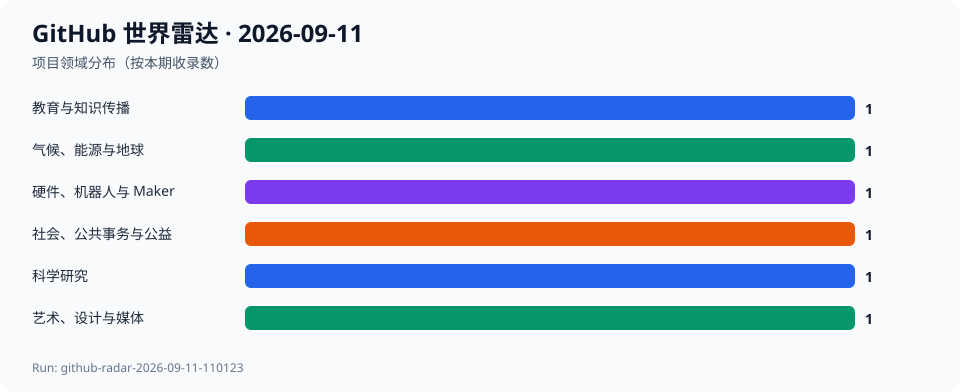
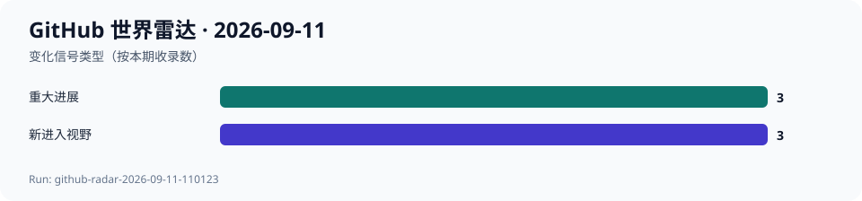

# GitHub 世界雷达 · 2026-09-11

> 生成时间：`2026-09-11T11:03:00+08:00` · 观察窗口：`2026-08-12` 至 `2026-09-11` · Run：`github-radar-2026-09-11-110123`

本期使用 GitHub Search 和仓库 API 复核。agent-reach 本机解释器缺失，故按其 GitHub/gh 路由使用 gh CLI。收录6个项目、6个领域；精确提交、发布或增长端点不可得均为null，未执行候选代码。

## 今日趋势

- 公共知识与本地媒体服务仍在持续维护。
- 气候模型和驾驶辅助的影响取决于真实边界与安全约束。
- 开放设计工具正在覆盖教育、公共服务和互动体验。

## 跨领域发现

| 项目 | 领域 | 它是什么 | 为什么现在 | 信号 | 阶段 | 置信度 |
| --- | --- | --- | --- | --- | --- | --- |
| [Revolutionary-Games/Thrive](../projects/Revolutionary-Games--Thrive.md) | 科学研究 | 项目方声明：Thrive 是进化主题模拟游戏。 | GitHub Search 显示仓库于2026-09-10有活动，本次快照3691 Stars。 | 推断：互动模拟可成为理解复杂生命系统的入口。 | 稳定发展 | 中 |
| [CliMA/Oceananigans.jl](../projects/CliMA--Oceananigans.jl.md) | 气候、能源与地球 | 项目方声明：这是海洋模拟工具。 | 相对历史记录，GitHub Search 显示2026-09-11仍有活动。 | 推断：地球系统模型需由持续维护支撑可复核性。 | 稳定发展 | 中 |
| [EbookFoundation/free-programming-books](../projects/EbookFoundation--free-programming-books.md) | 教育与知识传播 | 项目方声明：这是免费编程书籍清单。 | GitHub Search 显示2026-09-10活动，本次快照396466 Stars。 | 推断：开放学习资源的发现与维护本身就是教育基础设施。 | 稳定发展 | 高 |
| [suitenumerique/docs](../projects/suitenumerique--docs.md) | 社会、公共事务与公益 | 项目方声明：这是协作文档服务。 | GitHub Search 显示2026-09-10活动，本次快照16811 Stars。 | 推断：公共数字服务可通过开放协作工具积累能力。 | 快速成长 | 中 |
| [navidrome/navidrome](../projects/navidrome--navidrome.md) | 艺术、设计与媒体 | 项目方声明：这是个人音乐流媒体服务。 | 相对9月8日记录，GitHub Search 显示2026-09-11继续活动。 | 推断：本地媒体服务持续为数字收藏提供替代平台路径。 | 稳定发展 | 中 |
| [commaai/openpilot](../projects/commaai--openpilot.md) | 硬件、机器人与 Maker | 项目方声明：openpilot 可升级部分车辆驾驶辅助。 | 相对9月8日记录，GitHub Search 显示2026-09-11继续活动。 | 推断：开放驾驶辅助的可信度取决于安全边界和真实车辆支持。 | 稳定发展 | 中 |

